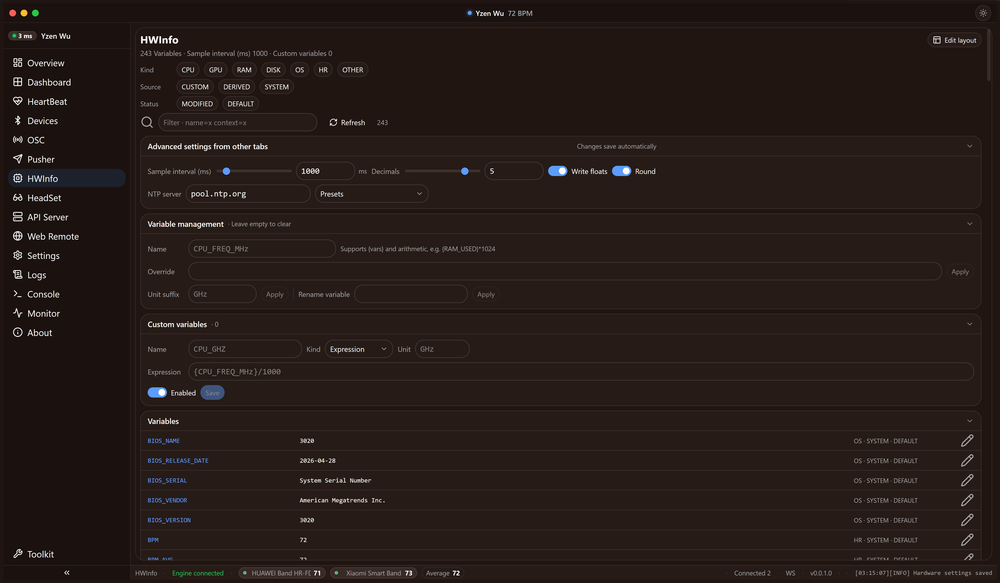

# HeartRateMonitor

Outil de fréquence cardiaque BLE en temps réel pour VRChat : envoie vos pulsations et la télémétrie matérielle dans la ChatBox via OSC — avec fenêtres flottantes, frontend web distant, CLI/TUI et une boîte à outils VRChat, le tout dans une seule application Windows.

[English](README.md) | [简体中文](README.zh-CN.md) | [繁體中文](README.zh-TW.md) | [繁體中文（香港）](README.zh-HK.md) | [粵語（香港）](README.yue-HK.md) | [日本語](README.ja.md) | [Español](README.es.md) | [한국어](README.ko.md) | [Deutsch](README.de.md) | **Français**


## Fonctionnalités

### Appareils de fréquence cardiaque BLE

- Lit tout appareil de fréquence cardiaque Bluetooth Low Energy standard (Heart Rate Service `0x180D`) — ceintures pectorales, bracelets, montres de sport.
- **Prise en charge multi-appareils** : connectez plusieurs capteurs à la fois ; la limite ne dépend que de la pile Bluetooth et du matériel.
- Notation et tri intelligents des appareils, alias, reconnexion automatique, alertes de signal faible (RSSI) et une fenêtre flottante par appareil.
- Détection automatique : connecte les appareils candidats par ordre de pondération, en ignorant les appareils audio/maison connectée et ceux sans caractéristique de fréquence cardiaque.


### Envoi OSC vers la ChatBox VRChat avec aperçu en direct

- Envoie « fréquence cardiaque + CPU / GPU / RAM et plus » vers la ChatBox VRChat (`/chatbox/input`) en OSC/UDP grâce à un modèle libre avec `{variables}`.
- Aperçu en direct du modèle rafraîchi chaque seconde pendant l'édition, avec compteur de caractères et avertissement non bloquant à l'approche de la limite de 144 caractères de la ChatBox.
- Envoi OSC personnalisé (adresse/texte libre), push sortant Webhook, récepteur OSC (port 9001) pour capturer le trafic des paramètres d'avatar VRChat, et option « envoi dès le démarrage ».




### Fenêtres flottantes

- Widgets de bureau toujours au premier plan affichant les BPM actuels (ou une image) ; une fenêtre principale plus une par appareil.
- Verrouillables avec traversée des clics, redimensionnement sensible à la DPI et géométrie persistée indépendamment pour chaque fenêtre.
- Source de données (moyenne ou appareil précis) et intervalle de rafraîchissement configurables par fenêtre.


### Variables de télémétrie matérielle

- Collecte les informations de l'hôte Windows via le registre, WMI, PowerShell et `systeminfo` ; les métriques temps réel (charge CPU/RAM/GPU/VRAM, températures, disque, mémoire validée) proviennent de PDH, la même source que le Gestionnaire des tâches.
- Tout devient une variable de modèle : `{CPU_USAGE}`, `{RAM_PERCENT}`, `{TIME_ISO}`, heure synchronisée NTP… plus des variables personnalisées (arithmétique, concaténation, regex, sortie de commande) et renommage/écrasement/unité par variable.
- Variables de processus dynamiques telles que `CPU_USAGE_VRCHAT`, `MEM_USAGE_<nom|PID>` et `USAGE_FILE_<chemin>`.

### État de santé

- Déduit un état (Sommeil / Repos / Actif / Excité) à partir de l'étalonnage de la fréquence au repos et de facteurs de seuil, en réagissant aussi aux paramètres de posture OSC (AFK / Assis / Vitesse).
- Exposé sous forme de variable `{HEALTH_STATUS}`, directement utilisable dans les modèles d'envoi.

### Enregistrement et export

- Enregistre les pulsations, le trafic OSC, l'état de santé et les instantanés matériels dans une base SQLite locale, avec backends JSONL/CSV quotidiens en option.
- Cinq catégories d'enregistrement (changements d'avatar, sessions VRChat, connexions d'appareils, détails des pulsations, instantanés matériels) avec rétention indépendante par catégorie.
- Page de statistiques (min/moyenne/médiane/max/écart-type, tendance, histogramme, par appareil, Top-N d'adresses OSC) sur plages sélectionnables ; export en TXT/JSON/YAML/CSV.

### Second frontend web distant (niveaux LAN/WAN + HTTPS)

- La même interface servie sur le même port unique (9460 par défaut) pour les téléphones et tablettes de votre réseau.
- Accès à niveaux selon la source : les connexions en boucle locale sont l'administrateur local (sans connexion) ; les sources LAN exigent l'interrupteur Remote et un compte local ; les sources publiques/WAN exigent en plus l'interrupteur WAN — qui réclame un mot de passe admin robuste et une boîte de dialogue explicite de confirmation du risque.
- Rôles (admin/utilisateur) avec listes blanches par section, stockage des mots de passe en PBKDF2, sessions liées à l'UA avec expiration d'inactivité, journal d'audit et HTTPS optionnel via empreinte de certificat.

### CLI / TUI

- `hrmcli.exe` (équivalent à `HeartRateMonitor.exe --cli`) : commandes en une passe pour les scripts, REPL en texte brut (`--shell`) et, par défaut, un TUI à menus façon TestDisk.
- Une quarantaine de commandes couvrant appareils, OSC, modèles d'envoi, variables matérielles, santé, enregistrement/export, web/distant, réglages d'interface, fenêtres flottantes et journaux — le même moteur de commandes que l'onglet console de l'application.

### Boîte à outils (Toolkit)

Un dock en bas à gauche de la barre latérale ouvre la boîte à outils VRChat :

- **Éditeur de config** — édition sous forme de tableau des champs usuels du `config.json` de VRChat avec validation stricte des types JSON.
- **Navigateur de journaux** — lister, lire et chercher dans les journaux VRChat.
- **Nettoyeur de cache** — analyse de l'occupation du cache et nettoyage, avec aperçu dry-run et phrase de confirmation.
- **Index photo** — indexation parallèle de la photothèque et recherche par mots-clés (métadonnées XMP des captures VRChat).
- **Statistiques de jeu** — statistiques agrégées de temps de jeu / pulsations / matériel avec graphiques.
- **Analyse de processus** — instantanés CPU/mémoire du processus VRChat.


### Mode sans échec

- `--safemode` (ou l'entrée dans les Paramètres / le geste triple R) suspend toute l'automatisation — connexion auto, détection auto, reconnexion auto, envoi OSC, collecte matérielle — pour faciliter le diagnostic, avec une bannière permanente et un redémarrage normal en un clic.

### Interface : dix langues et thèmes

- Interface en dix langues : 繁體中文 / 简体中文 / 繁體中文（香港） / 粵語（香港） / English / 日本語 / Español / 한국어 / Deutsch / Français ; le CLI et les journaux suivent la même langue.
- Mode clair/sombre × palettes de couleurs (défaut / forêt / coucher de soleil / océan / violet / **mode couleur unie personnalisée** avec votre propre couleur d'accent, de fond et de panneau), curseurs de rayon des angles et de densité, suivi du thème système et interrupteur global des animations.
- Les préférences de mise en page (ordre des cartes, largeurs de colonnes, réglages des courbes…) sont stockées localement et répliquées côté backend, et survivent aux réinstallations.

## Configuration requise

- Windows 10 ou 11, 64 bits (x64).
- Microsoft Edge WebView2 Runtime (préinstallé sur la plupart des systèmes ; sinon installez le Runtime Evergreen de Microsoft).
- Un adaptateur Bluetooth compatible BLE (intégré ou clé USB).
- Facultatif : la build dépendante du framework nécessite le runtime .NET 10 — la build standalone est autonome.

## Utilisation à partir d'un ZIP compilé

1. Téléchargez le dernier `HeartRateMonitor-*-x64.zip` depuis [Releases](https://github.com/yzenwu/VRC-HRMonitor/releases) et extrayez-le où vous voulez.
2. Lancez `HeartRateMonitor.exe` (ou `hrm-webui.exe`) : le moteur s'installe dans la barre d'état système et la fenêtre WebView2 s'ouvre avec un écran de démarrage.
3. Au premier lancement, la configuration est écrite dans le répertoire de données `%AppData%\HeartRateMonitor` (les journaux, exports et la base de données y vivent aussi ; l'emplacement peut être redirigé via un fichier `data_location.txt` à côté de l'exécutable).
4. Lancez un scan, connectez votre capteur BLE, activez l'envoi OSC puis entrez dans VRChat — la ChatBox commence à se mettre à jour.
5. `hrmcli.exe` est l'équivalent en terminal ; `hrmdump.exe` s'exécute automatiquement comme chien de garde contre les plantages.
6. Accès à distance depuis un téléphone : activez l'interrupteur Remote (onglet Web), ouvrez `http://<IP-DU-PC>:9460/webui/` depuis le même réseau et connectez-vous avec un compte local.

## Compiler à partir des sources

> Ce dépôt est un instantané des sources du projet.

Prérequis :

- **gcc (MinGW-w64)** — compile le moteur OSC en C (`Engine/`).
- **.NET 10 SDK** — publie les quatre exécutables C# (`HeartRateMonitor.exe`, `hrm-webui.exe`, `hrmcli.exe`, `hrmdump.exe`).
- **Node.js + npm** — construit le frontend Vue 3 (`WebUI/`).

Compilation depuis la racine du dépôt (PowerShell) :

```powershell
./build.ps1 --releases     # version dépendante du framework + ZIP
./build.ps1 --debug        # build de débogage avec console et journaux détaillés
```

Le script construit le moteur C, puis le frontend web (vite), puis les quatre projets .NET, et écrit tout dans `Built/<branche>-<horodatage>/` ; les builds release produisent en plus un `HeartRateMonitor-*-x64.zip` accompagné de son SHA-256. `Release.json` est l'unique source des métadonnées de publication (versions, icônes, dépôt, date de build, licence) et est intégrée aux exécutables lors de la compilation. Ne lancez pas deux builds en parallèle (ils partagent les répertoires intermédiaires `obj/`).

## Licence

[MIT](LICENSE) — © Yzen Wu.

---

## AIGC Context
  
**La majeure partie du contenu du projet a été générée par ChatGPT et Claude Opus. Si vous avez des questions ou des suggestions, veuillez ouvrir une issue ou soumettre une PR dans le dépôt.**
