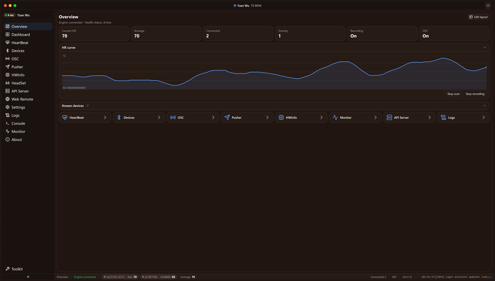
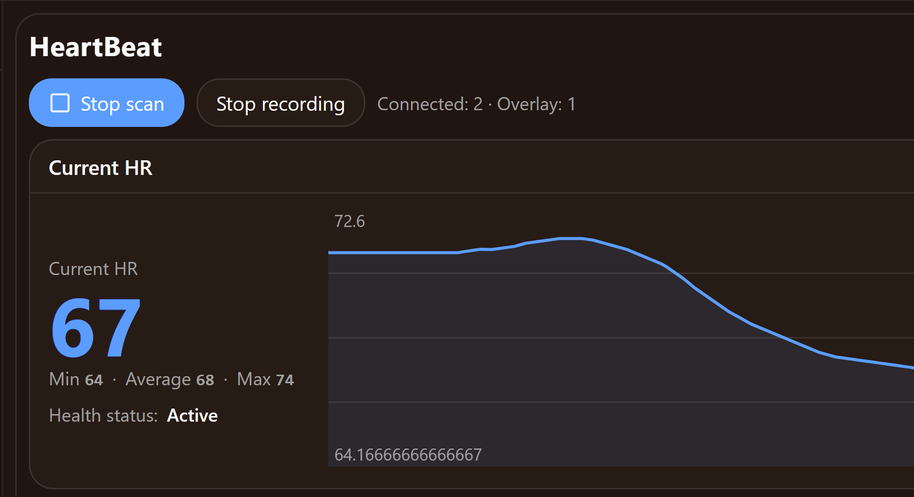
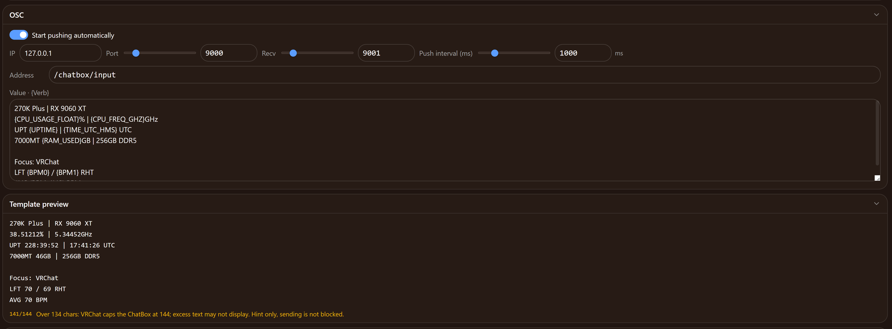
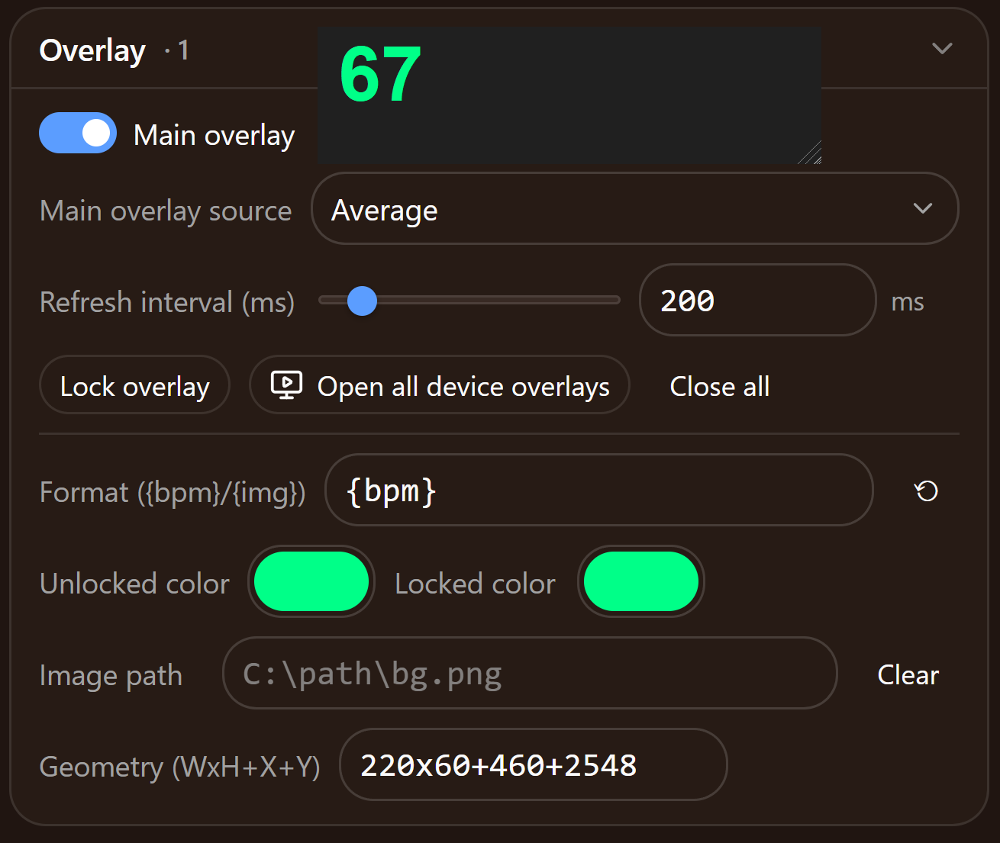
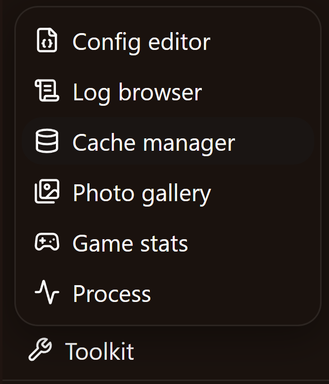

# HeartRateMonitor

面向 VRChat 的实时 BLE 心率工具：通过 OSC 把心率与硬件遥测推送到聊天框——附带悬浮窗、远程 Web 前端、CLI/TUI 与 VRChat 工具集的单体 Windows 应用。

[English](README.md) | **简体中文** | [繁體中文](README.zh-TW.md) | [繁體中文（香港）](README.zh-HK.md) | [粵語（香港）](README.yue-HK.md) | [日本語](README.ja.md) | [Español](README.es.md) | [한국어](README.ko.md) | [Deutsch](README.de.md) | [Français](README.fr.md)



## 功能特性

### BLE 心率设备

- 读取任意标准低功耗蓝牙心率设备（Heart Rate Service `0x180D`）——胸带、手环、运动手表。
- **多设备支持**：同时连接多个传感器，上限只受蓝牙协议栈与硬件约束。
- 智能设备评分排序、别名、自动重连、弱信号（RSSI）告警、按设备独立悬浮窗。
- 自动检测：按权重批量连接候选设备，自动跳过音频/智能家居设备与无心率特征的设备。



### VRChat OSC 聊天框推送与实时预览

- 以自由 `{变量}` 模板经 OSC/UDP 把「心率 + CPU / GPU / 内存等」推送到 VRChat 聊天框（`/chatbox/input`）。
- 编辑时每秒刷新的模板实时预览，带字数统计，接近聊天框 144 字上限时提示（不拦截发送）。
- 自定义 OSC 发送（任意地址/文本）、Webhook 出站推送、OSC 接收（9001 端口）捕获 VRChat Avatar 参数流量、可选「启动即推送」。



### 悬浮窗

- 置顶桌面小组件显示当前 BPM（或图片）；一个主窗 + 每设备一窗。
- 可锁定并点击穿透、DPI 感知缩放、每窗几何独立持久化。
- 每窗数据源（平均或指定设备）与刷新间隔均可配置。



### 硬件遥测变量

- 经注册表、WMI、PowerShell 与 `systeminfo` 采集 Windows 主机信息；经 PDH 获取实时指标（CPU/内存/GPU/显存占用、温度、磁盘、内存提交），与任务管理器同源。
- 一切皆可为模板变量：`{CPU_USAGE}`、`{RAM_PERCENT}`、`{TIME_ISO}`、NTP 校时……另有自定义变量（四则运算/拼接/正则/命令输出）、按变量改名/覆写/单位。
- 动态进程变量如 `CPU_USAGE_VRCHAT`、`MEM_USAGE_<名称|PID>` 与 `USAGE_FILE_<路径>`。

### 健康状态

- 由静息心率校准与阈值系数推导状态（睡眠 / 静息 / 活动 / 兴奋），并响应 OSC 姿态参数（AFK / 坐姿 / 移动速度）。
- 以 `{HEALTH_STATUS}` 变量暴露，可直接用于推送模板。

### 记录与导出

- 心率、OSC 流量、健康状态与硬件快照记录到本地 SQLite，可选按日 JSONL/CSV 后端。
- 五类记录（Avatar 变更、VRChat 会话、设备连接、心率详情、硬件快照），各类独立保留天数。
- 统计页（最小/平均/中位/最大/标准差、趋势、直方图、按设备、OSC 地址 Top-N）支持区间选择，可导出 TXT/JSON/YAML/CSV。

### 远程 Web 第二前端（LAN/WAN 分级 + HTTPS）

- 同一份 UI 经同一端口（默认 9460）提供给局域网内的手机和平板。
- 来源分级访问：回环连接即本地管理员（无需登录）；局域网来源需开启远程开关并登录本机账号；公网来源额外需要 WAN 开关——后者要求 admin 强密码与显式风险确认弹窗。
- 角色（admin/user）按板块白名单授权、PBKDF2 密码存储、绑定 UA 的会话与闲置过期、审计日志，以及基于证书指纹的可选 HTTPS。

### CLI / TUI

- `hrmcli.exe`（与 `HeartRateMonitor.exe --cli` 等价）：供脚本调用的一次性命令、纯文本 REPL（`--shell`）、默认进入 TestDisk 风格菜单 TUI。
- 约 40 条命令覆盖设备、OSC、推送模板、硬件变量、健康、记录/导出、Web/远程、界面设置、悬浮窗与日志——与应用内控制台页共用同一命令引擎。

### Toolkit 工具集

侧栏左下角的 dock 打开 VRChat 工具集：

- **config 编辑器**——VRChat `config.json` 常用字段的表格化编辑，严格 JSON 类型校验。
- **日志浏览**——VRChat 日志的列表/读取/搜索。
- **缓存清理**——缓存占用分析与清理，含 dry-run 预览与确认短语。
- **照片索引**——照片库并行索引与关键词搜索（VRChat 截图 XMP 元数据）。
- **游戏分析**——游戏时长/心率/硬件数据的聚合统计与图表。
- **进程分析**——VRChat 进程 CPU/内存快照。



### 安全模式

- `--safemode`（或设置页入口 / 三连 R 手势）暂停一切自动化——自动连接、自动检测、自动重连、OSC 推送、硬件采集——便于排障；激活时常驻警示条，可一键正常重启。

### 界面：十语言与主题

- 界面支持十种语言：繁體中文 / 简体中文 / 繁體中文（香港） / 粵語（香港） / English / 日本語 / Español / 한국어 / Deutsch / Français；CLI 与日志跟随同一语言。
- 明暗模式 × 配色（默认 / 森林 / 落日 / 海洋 / 紫罗兰 / **纯色自定义模式**，自选强调色/背景/面板），圆角与密度滑块、遵循系统主题、全局动画开关。
- 布局偏好（卡片顺序、列宽、曲线参数……）本地存储并镜像到后端，重装不丢。

## 系统要求

- Windows 10 或 11，64 位（x64）。
- Microsoft Edge WebView2 运行时（多数系统已预装；否则请安装微软 Evergreen 运行时）。
- 支持低功耗蓝牙的适配器（内置或 USB 适配器）。
- 可选：框架依赖构建需 .NET 10 运行时——standalone 构建自带运行时。

## 从 Built ZIP 使用

1. 从 [Releases](https://github.com/yzenwu/VRC-HRMonitor/releases) 下载最新的 `HeartRateMonitor-*-x64.zip` 并解压到任意位置。
2. 运行 `HeartRateMonitor.exe`（或 `hrm-webui.exe`）：引擎进入系统托盘，WebView2 窗口随启动页打开。
3. 首次启动会把配置写入数据目录 `%AppData%\HeartRateMonitor`（日志、导出与数据库也在该目录；可在 exe 旁放置 `data_location.txt` 重定向）。
4. 开始扫描、连接 BLE 传感器、启用 OSC 推送并进入 VRChat——聊天框开始刷新。
5. `hrmcli.exe` 是终端等价物；`hrmdump.exe` 作为崩溃守护自动运行。
6. 手机远程访问：开启远程开关（Web 页），在同一网络下用手机打开 `http://<PC-IP>:9460/webui/` 并登录本机账号。

## 从源码构建

> 本仓库是项目的源码快照。

前置依赖：

- **gcc（MinGW-w64）**——编译 C OSC 引擎（`Engine/`）。
- **.NET 10 SDK**——发布四个 C# 可执行程序（`HeartRateMonitor.exe`、`hrm-webui.exe`、`hrmcli.exe`、`hrmdump.exe`）。
- **Node.js + npm**——构建 Vue 3 前端（`WebUI/`）。

在仓库根目录构建（PowerShell）：

```powershell
./build.ps1 --releases     # 框架依赖发布 + ZIP
./build.ps1 --debug        # Debug 构建：控制台 + 详细日志
```

脚本依次构建 C 引擎、Web 前端（vite）与四个 .NET 工程，产物输出到 `Built/<分支>-<时间戳>/`；release 构建额外产出带 SHA-256 校验文件的 `HeartRateMonitor-*-x64.zip`。`Release.json` 是发布元数据单一来源（版本、图标、仓库、构建时间、许可证），构建时嵌入可执行程序。请勿并行运行两个构建（共享中间 `obj/` 目录）。

## 许可证

[MIT](LICENSE) — © Yzen Wu.

---

## AIGC Context
  
**本项目的大部分内容由 ChatGPT 与 Claude Opus 生成。如有任何问题或建议，请在仓库中提出 issue 或提交 PR。**
